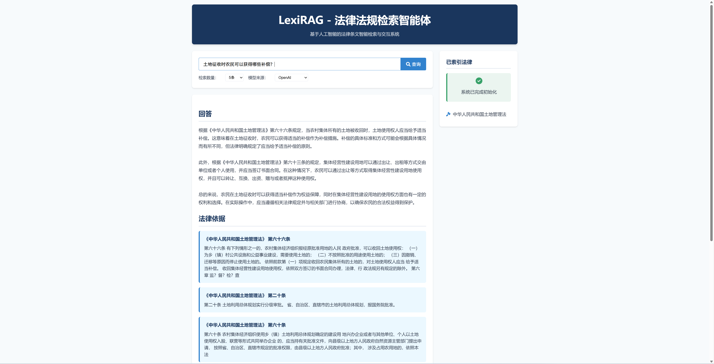

# LexiRAG - 法律法规检索智能体

## 项目简介

LexiRAG 是一个基于人工智能的法律条文智能检索与交互系统，旨在帮助用户快速、准确地查询和理解中国法律法规。系统采用了检索增强生成（RAG）技术，结合向量检索和大语言模型，实现了对法律文档的智能检索和问答功能。



本项目支持两种模型来源：
- **OpenAI API**：使用OpenAI的GPT模型和Embedding模型进行处理
- **本地Ollama**：使用本地部署的开源大语言模型，无需联网，保护数据隐私

### 核心特性

- 📚 **法律文档智能检索**：基于语义相似度进行法律条文的精准检索
- 🔍 **分层检索策略**：优先按法律、章节、条款的层次结构进行检索，提高相关性
- 💡 **法律专业解析**：基于大语言模型对法律条文进行专业解释和应用分析
- 🖥️ **友好的Web界面**：直观的用户交互界面，支持灵活的查询配置
- 🔄 **双模型源支持**：支持OpenAI API和本地Ollama模型，满足不同场景需求
- 🛠️ **专为法律文本优化**：针对法律文档特点的专用文本分割器和处理流程

## 系统架构

本系统主要由以下几个部分组成：

1. **文档处理模块**：负责加载和解析PDF、Markdown等格式的法律文档
2. **向量化模块**：将法律文本转换为语义向量，支持OpenAI和Ollama的Embedding模型
3. **检索引擎**：基于Chroma向量数据库的分层检索系统
4. **LLM推理模块**：基于检索结果生成专业法律解答
5. **Web服务**：基于FastAPI构建的REST API和静态Web界面

## 快速开始

### 环境要求

- Python 3.11+
- 操作系统：Windows/macOS/Linux

### 安装步骤

1. **克隆仓库**

```bash
git clone https://github.com/yourusername/laws_project.git
cd laws_project
```

2. **创建并激活虚拟环境**

```bash
# Windows
python -m venv laws
laws\Scripts\activate

# macOS/Linux
python -m venv laws
source laws/bin/activate
```

3. **安装依赖**

```bash
pip install -r requirements.txt
```

4. **配置环境变量**

创建`.env`文件并配置以下内容：

```
# OpenAI配置
OPENAI_API_KEY=your_openai_api_key
OPENAI_BASE_URL=https://api.openai.com/v1
LLM_MODEL=gpt-3.5-turbo
EMBEDDING_MODEL=text-embedding-3-small

# Ollama配置
OLLAMA_LLM_MODEL=qwen2.5:3b
OLLAMA_EMBEDDING_MODEL=bge-m3
```

5. **准备法律文档**

将法律文档（PDF、Markdown或TXT格式）放入`laws_files`文件夹。

6. **运行应用**

```bash
python app.py
```

浏览器访问：http://localhost:9000


## 使用指南

### Web界面

1. 打开浏览器访问http://localhost:9000
2. 在搜索框中输入法律相关问题
3. 选择检索数量和模型来源
4. 点击"查询"按钮获取结果
5. 查看系统给出的回答和法律依据

### 切换模型

在Web界面中，您可以选择使用：
- **OpenAI**：需要API密钥，质量更高，但需要联网和API费用
- **Ollama(本地)**：需要本地运行Ollama服务，无需联网，保护数据隐私

## 核心算法

### 分层检索策略

系统采用三层检索策略：

1. **法律级检索**：首先确定与查询最相关的法律
2. **章节级检索**：在相关法律中定位最相关章节
3. **条款级检索**：在相关章节中精确定位具体条款

这种分层策略能有效提高检索精度，更好地匹配法律文本的层次结构。

### 法律文本处理

系统使用专门为法律文档设计的`LawTextSplitter`，可以智能识别和处理：
- 法律条款结构（"第X条"）
- 章节划分（"第X章"）
- 保留法律文本的元数据和引用关系

## 项目文件结构

```
laws_project/
├── app.py                 # FastAPI应用入口
├── rag.py                 # RAG系统核心实现
├── requirements.txt       # 项目依赖
├── static/                # 前端静态文件
│   ├── index.html         # Web界面
│   ├── script.js          # 前端交互脚本
│   └── styles.css         # 样式表
├── laws_files/            # 原始法律文档存储
├── laws_index_openai/     # OpenAI模型向量索引
└── laws_index_ollama/     # Ollama模型向量索引
```

## 参与贡献

欢迎提交Issues和Pull Requests！